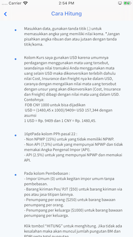
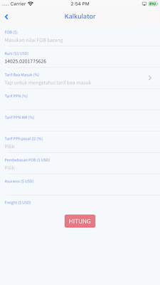

# Bea-Masuk

A tool to calculate how much tax that you have to pay for importing product to Indonesia.

# Hot to use:
- git clone
- pod install

# Screenshoot:

# Todo
- fix format number for some screen
- add animation
- refactor old code
